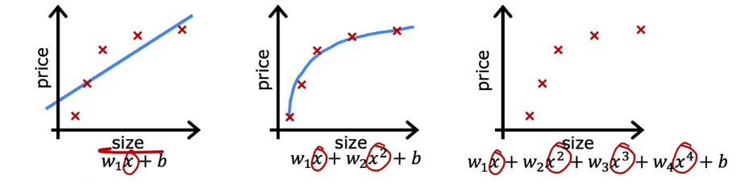

# 개요      

기계학습 model을 training 할 때 주어진 학습 데이터에 완벽히 들어맞게끔 model를 training 했다고 가정해보자. Model이 training data에 완벽히 들어맞는다면 그건 model의 성능이 뛰어나다는 것일까? 꼭 그런건 아닐 수 있다. 

왜 그런지 overfitting의 개념을 통해 알아보자. 


## The problem of overfitting

기계학습을 배울 때 흔히 사용하는 예시인 집 값 예측을 해보자. x를 집의 크기로, y를 가격으로 둔 training data가 있다고 하고 이를 각기 다른 regression으로 training 시킨 모델 3가지를 보도록 하자. 




```python
print("Hello, world!") 
```

```java
public static void main(String[] args) {
    Console.log.printf("GoGart :>")
}
```

### Photo Example

