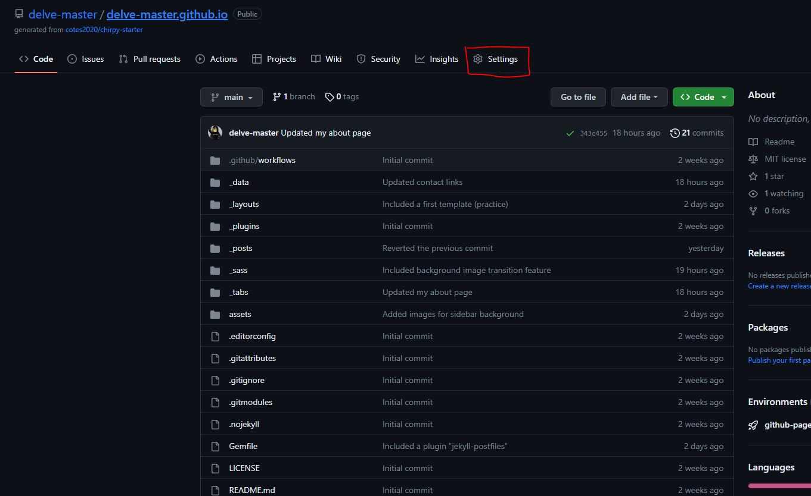
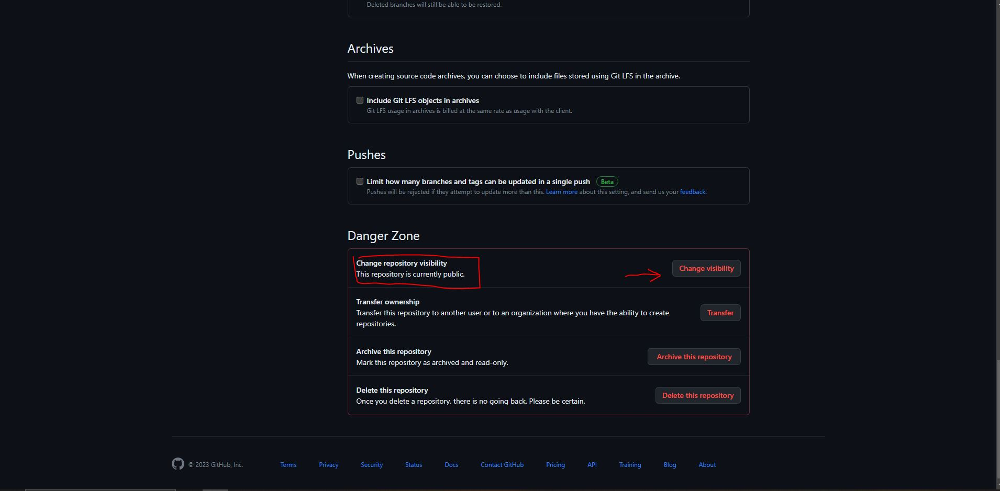
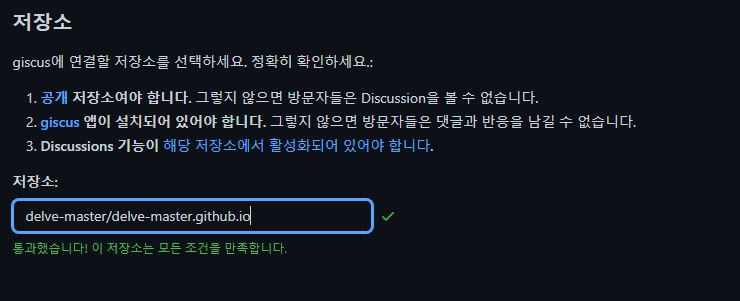
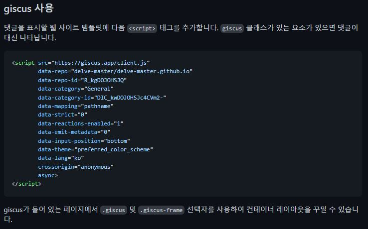
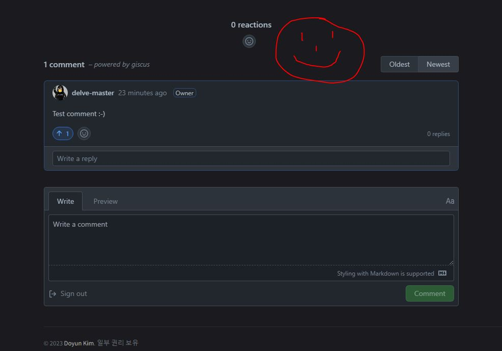

# 개요 

네이버 블로그같은 기업 제공 [가입형 블로그](https://curlykim.tistory.com/entry/%EB%B8%94%EB%A1%9C%EA%B7%B8%EB%9E%80-%EB%B8%94%EB%A1%9C%EA%B7%B8-%EC%A2%85%EB%A5%98)에는 흔히 댓글을 달 수 있는 기능이 기본적으로 제공된다. 

하지만 Jekyll과 같은 설치형 블로그는 블로그의 주인이 직접 필요한 기능을 추가하거나 관리해야 하기 때문에 처음 블로그를 구축했을때는 댓글 기능이 존재하지 않는 경우가 많다. 

이번 포스팅에서는 Jekyll로 구축된 블로그에 댓글 기능을 추가하는 법을 알아보자. 참고로 추가 방법은 사용중인 테마 및 작업 환경에 따라 다를 수 있다. 이 포스팅은 Chirpy theme을 중심으로 설명한다.  


# 댓글 기능 서비스 제공자

온라인에는 댓글 기능을 서비스해주는 소스가 꽤 많이 존재한다. 내가 쓰는 이 블로그의 테마인 Chirpy는 **disqus**, **utterances**, **giscus** 세 가지의 댓글 서비스를 지원해준다.[^1] 이 세 개의 댓글 서비스는 Chirpy의 `config.yml`에서 쉽게 설정할 수 있다.

```yaml
comments:
  active: # The global switch for posts comments, e.g., 'disqus'.  Keep it empty means disable
  # The active options are as follows:
  disqus:
    shortname: # fill with the Disqus shortname. › https://help.disqus.com/en/articles/1717111-what-s-a-shortname
  # utterances settings › https://utteranc.es/
  utterances:
    repo: # <gh-username>/<repo>
    issue_term: # < url | pathname | title | ...>
  # Giscus options › https://giscus.app
  giscus:
    repo: # <gh-username>/<repo>
    repo_id:
    category:
    category_id:
    mapping: # optional, default to 'pathname'
    input_position: # optional, default to 'bottom'
    lang: # optional, default to the value of `site.lang`
    reactions_enabled: # optional, default to the value of `1`
```

나는 Chirpy의 [데모 사이트](https://chirpy.cotes.page/posts/getting-started/)에서 본 댓글창이 마음에 들어서 내 블로그에는 giscus를 추가하기로 했다. 

## Giscus 추가하기

우선 공식 [Giscus 사이트](https://giscus.app/ko)에 들어가서 설정을 시작한다.

Giscus를 이용하기 위해서는 갖추어야 할 조건 3가지가 있다.

- Github 저장소(Repository)가 **공개** 상태일 것
- Giscus가 저장소에 **설치**되어있을 것
- Github 저장소의 Discussions 기능이 **활성화**된 상태일 것

#### Github 저장소를 공개상태로 바꾸는 법은 다음과 같다:


저장소 홈에서 설정으로 들어간다.


아래로 쭉 내리면 빨갛게 칠해진 "위험 구역"이 나온다. 여기서 저장소의 공개 상태를 변경할 수 있다. 이미 공개상태라면 당연히 아무것도 할 필요가 없다. 

#### 다음으로 Giscus를 저장소에 설치해야한다. 

Github Marketplace의 [Giscus 앱](https://github.com/apps/giscus)을 Giscus를 추가하고자 하는 저장소에 설치하자. 

#### 마지막으로 Github 저장소의 Discussions 기능이 활성화되야한다. 
이는 [이 가이드](https://docs.github.com/en/repositories/managing-your-repositorys-settings-and-features/enabling-features-for-your-repository/enabling-or-disabling-github-discussions-for-a-repository)를 활용하자. 
<br>
<br>

이 준비가 모두 끝났다면 Giscus 설정 사이트에 저장소 주소를 기입하면된다. 준비가 정상적으로 되었다면 아래와 같은 결과를 확인할 수 있다. 



이보다 아래에 있는 **페이지 ↔️ Discussions 연결**과 **Discussion 카테고리** 섹션은 Github Discussions 검색 API가 어떻게 귀하의 포스팅에 달린 댓글의 Discussions을 찾을지 설정하는 곳이다.[^2] 나는 카테고리 설정을 **Announcements**로 하는 것 외에 별다른 설정을 바꾸지는 않았다. 

이외의 **기능** 및 **테마** 섹션은 자신이 원하는 설정을 하도록 하자. 굳이 설정하지 않아도 댓글 기능은 작동한다. 

<br>
이제 **giscus 사용** 섹션을 보면 지금까지 설정한 내용들을 담은 소스코드를 확인할 수 있다. 



Chirpy의 경우 이미 `config.yml`에 giscus 설정관련 내용이 존재하기에 이를 수정만하면 된다. 

```yaml
comments:
    active: giscus # The global switch for posts comments, e.g., 'disqus'.  Keep it empty means disable
    ...
    ...
 # Giscus options › https://giscus.app
    giscus:
        repo: delve-master/delve-master.github.io # <gh-username>/<repo>
        repo_id: R_kgDOJOHSJQ
        category: Announcements
        category_id: DIC_kwDOJOHSJc4CVm29
        mapping: # optional, default to 'pathname'
        input_position: # optional, default to 'bottom'
        lang: # optional, default to the value of `site.lang`
        reactions_enabled: # optional, default to the value of `1`
```

이제 저장하고 호스팅된 블로그를 확인해보면 댓글창이 생긴것을 알 수 있다!




(*end of post*)

---

[^1]: 물론 이 세 가지만 쓸 수 있다는 말은 아니다.
[^2]:누군가가 포스팅에 댓글을 달면, 이 댓글은 질문, 공지사항, 투표 등의 카테고리에 속하는 *대화*(Discussions)를 열게된다. 즉, 댓글은 다는것은 댓글 하나가 아닌 일종의 대화를 시작하는 행위라고 볼 수 있다.