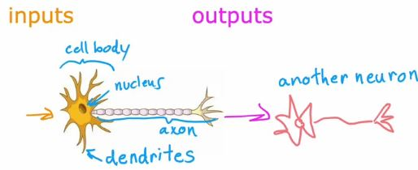
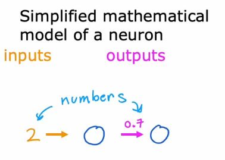
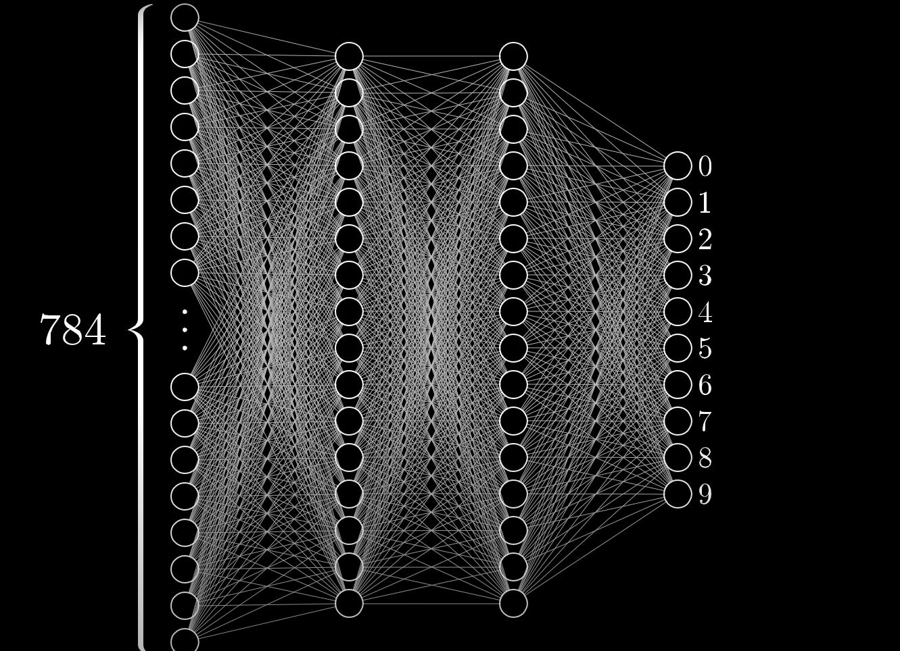

> 이 포스팅은 Andrew Ng. 박사가 Machine Learning Specialization Coursera 강의에서 다룬 내용을 포함합니다.

딥러닝(deep learning)은 2010년대 들어서부터 급격하게 주목받기 시작한 기계학습법 중 하나이다. 하지만 딥러닝의 정수라고 할 수 있는 인공신경망(neural network) 개념은 [1940년대에 처음 등장했다](https://news.mit.edu/2017/explained-neural-networks-deep-learning-0414#:~:text=Neural%20networks%20were%20first%20proposed,the%20first%20cognitive%20science%20department.). 왜 이런 획기적인 기술이 70년이나 늦게 주목받기 시작했을까? 

## 인공신경망과 딥러닝

먼저 인공신경망과 딥러닝의 관계를 짚고 넘어가자. 

**딥러닝은 인공신경망을 이용해 모델을 학습시키는 기계학습 기법이다.** 

인공신경망이라는 이름에서 유추할 수 있듯이, 원래 인공신경망은 사람의 뇌가 작동하는 방식을 컴퓨터의 연산에 적용하려한 시도에서 만들어진 물건이다. 

사람의 뇌는 뉴런이라 불리는 수많은 뇌세포로 구성되어 있다. 이 뉴런들은 다른 뉴런들과 연결되어 있는데, 연결되어 있는 뉴런 하나가 전기 신호를 보내면 그 신호를 받은 다른 뉴런이 이에 반응해 또 다른 뉴런에게 전기 신호를 보내는 식으로 연쇄반응을 한다.

이런 작동방식을 컴퓨터로 간단하게 구현하면 

이렇게 된다. 근본적인 작동원리는 같다. 이전 뉴런에서 입력값을 주면 그 입력값을 바탕으로 다음 뉴런에게 출력값을 보낸다.

물론 뉴런의 양이 적으면 정확도는 떨어진다. 마치 뉴런의 양이 적은 동물들이 해결할 수 있는 문제가 많지 않은것과 비슷하다. 그렇기 때문에 실생활에 적용할 수 있을 정도의 인공신경망은 보통 많은 양의 뉴런들로 구성된 여러개의 층이 존재한다.

위의 신경망은 [3Blue1Brown의 유튜브 영상](https://youtu.be/aircAruvnKk)에서 임의로 만들어낸 신경망으로, 이미지 안에 손글씨로 작성된 숫자를 맞추기 위해 784개의 픽셀값과 2개의 뉴런층으로 구성되어있다. 각각의 픽셀이 가진 색이 모이면 그림의 한 부분이 되고 이를 조합하면 완성된 그림이 되는 것처럼, 784개의 픽셀을 각각 하나의 뉴런으로 취급하고 픽셀 하나하나의 rgb값을 연결된 다음 뉴런층으로 보내면 알고리즘이 출력값을 그 다음 뉴런층으로 보내는 식으로하여 최종적으로 이미지 내의 숫자를 맞추는 방식이다. 

딥러닝은 이런 인공신경망을 이용한 기계학습의 한 분야이다. 

## 딥러닝은 왜 갑자기 주목받을까?
딥러닝을 보면 매력적인 요소가 참 많다. 뭔가 deep한 학습이라하니 아주 정확한 기계학습 기법일 것이라는 기대감도 가질 수 있을것만 같다. 

전술했듯, 딥러닝의 정수인 인공신경망 개념은 1944년에 처음 발표되었다. 최초의 인공신경망은 수학적으로 인간의 뇌를 구현하기 위한 시도였고 이를 응용한 손글씨 감지 알고리즘등이 1980년대에 사용되기도 했다.[^1] 

하지만 그것과는 별개로 2000년대 이전에는 인공신경망 기반의 딥러닝은 크게 발전하지 않았는데, 이에는 여러가지 이유가 있다.  

### 컴퓨터의 열악한 연산력, 제한된 데이터
딥러닝이 두각을 드러내기 위해서는 많은 양의 데이터를 필요로 하는데, 2000년대 이전에는 그렇게 많은 데이터를 확보하는게 힘들었고 그만한 양의 데이터를 처리할 수 있는 연산력도 제한적이었다. 

### 제대로 정립되지 않은 개념
당시의 과학자들이 아직 인공신경망 기반의 딥러닝을 제대로 이해하지 못했던 것도 한 몫했는데, 모델을 효율적으로 학습시키기 위한 알고리즘이 존재하지 않았다. 

### 뛰어난 대체재의 존재
무엇보다 딥러닝의 대체재로 의사결정 트리(decision tree)나 서포트 벡터 머신(support vector machine—svm)등의 효율이 뛰어난 알고리즘이 있었기때문에 딥러닝을 굳이 고집할 이유가 없었다.  

**하지만 기술이 발전하기 시작하면서 딥러닝은 점점 주목받기 시작했다.**

딥러닝이 활용되지 못했던 가장 큰 이유중 하나인 기술적 한계가 그래픽 카드[^2]의 발전과 함께 깨지게되고 과학자들의 끊임없는 연구로 딥러닝 알고리즘이 정립되면서 딥러닝의 학습 효율이 다른 알고리즘을 훨씬 상회하는 성과를 내게되었다.

그 덕에 요즘 흔히 사용되는 대화 감지(speech recognition)나 사물 감지(object detection)등의 편의가 가능하게 되었고, 데이터가 충분하다 못해 넘쳐나는 2020년대에는 더욱 더 활용도가 높아질 것이라는 기대가 겹쳐 지금의 딥러닝 열풍이 불고 있다고 할 수 있겠다.

(*end of post*)

---

[^1]: 당시에는 편지에 적힌 우편번호나 수표에 적힌 액수를 읽어내는 용도로 사용되었다.
[^2]: 그래픽 카드의 발전은 원래 빠르게 향상되는 게임의 그래픽과 요구연산량에 기반하지만, 그래픽 카드가 많은 양의 데이터를 처리할 때 뛰어난 성능을 발휘하는 것이 밝혀지며 딥러닝에도 적극 활용되게된다. 참고로 그래픽 카드가 본래의 용도와 관련이 없는 딥러닝에 뛰어난 성능을 보이는 것은 그래픽 카드의 병렬 연산능력에 있다. 무거운 작업을 여러개의 가벼운 작업들로 나누어 동시에 처리하는 방식으로 높은 효율의 연산을 수행할 수 있다. 
