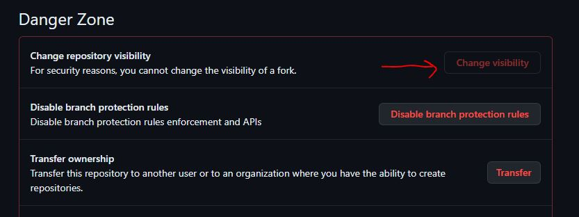
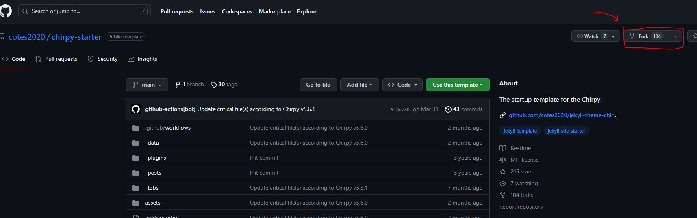

> 이 포스팅은 stack overflow에 올라온 ["GitHub: How to make a fork of public repository private?"에 달린 답변](https://stackoverflow.com/questions/10065526/github-how-to-make-a-fork-of-public-repository-private/30352360#30352360)에서 발췌한 내용을 포함하고 있습니다.

Github에서는 공개된 리포지토리(public repository)를 포크할 경우, 포크한 리포지토리는 보안상의 이유로 비공개로 설정할 수 없다.[^1]  




이번 포스팅에서는 공개 리포지토리를 복사한 뒤에 비공개로 변경점을 만드는 방법을 설명한다.

### 새 리포지토리 생성
우선적으로, cmd나 Github에서 새 리포지토리를 생성한다. 이 리포지토리를 비공개로 할 것이므로 비공개로 생성하자. 편의를 위해 *private-repo*라 지칭한다. 내가 복사하고자 하는 공개 리포지토리는 *public-repo*로 지칭하겠다. 

리포지토리가 생성됐다면 git bash 같은 CUI에 아래의 명령어를 실행한다. 

```bash
git clone --bare https://github.com/exampleuser/public-repo.git
cd public-repo.git
git push --mirror https://github.com/yourname/private-repo.git
cd ..
rm -rf public-repo.git
```

{: .warning} 
git bash 로 작업을 수행한다면 git bash 에 로그인되어 있는 계정이 리포지토리가 생성되었던 계정과 동일해야 한다. 그렇지 않으면 `git push --mirror https://github.com/yourname/private-repo.git` 단계에서 에러를 보게 될 것이다. 

여기서 *exampleuser*는 복사했던 public-repo 의 주인이며, *yourname* 은 나다. 
`git push --mirror <...>` 부분은 private-repo 에 public-repo 의 미러를 붙여넣는다.
`rm -rf public-repo.git`은 더 이상 필요 없는 public-repo 의 클론을 제거하기 위해 필요하다.  


### 비공개 리포지토리 git clone
내가 비공개로 설정한 remote repository 가 생성되었으니 이제 `git clone` 해서 신나게 코딩하면 된다.[^2] 

```bash
git clone https://github.com/yourname/private-repo.git
```

### 원 리포지토리의 commit 가져오기
public-repo의 commit을 내 리포지토리로 가져오고 싶다면 다음 명령어를 사용하자.

```bash
cd private-repo
git remote add public https://github.com/exampleuser/public-repo.git
git pull public main # merge commit 생성
git push origin main
```
이렇게 하면 public-repo의 업데이트와 내가 업데이트한 내용을 전부 private-repo에 반영할 수 있다. 

### 원 리포지토리에 pull 요청하기
private-repo에서 만든 변경점을 public-repo에 적용하고 싶다면 해당 리포지토리에 pull request를 넣으면 된다.

먼저 public-repo를 포크하자. 편의상 포크한 리포지토리는 `the-fork`라 하겠다. 이미 설명했지만 공개 리포지토리의 포크는 비공개로 할 수 없으므로 `the-fork`**는 항상 공개 리포지토리이다**. 


<p class="caption">public-repo를 포크 하는 과정</p>

이후 아래의 명령어를 이용하자. 참고로 *private_repo_yourname* 등과 같은 이름들은 상황에 맞게 바꾸도록 하자. 

```bash
git clone https://github.com/yourname/the-fork.git
cd the-fork
git remote add private_repo_yourname https://github.com/yourname/private-repo.git
git checkout -b pull_request_yourname
git pull private_repo_yourname main
git push origin pull_request_yourname
```

내 컴퓨터에서 리포지토리를 수정하기 위해 `git clone`은 필수. `cd the-fork`를 통해 working directory를 the-fork 리포지토리로 바꾼다. 

`git remote add` 명령어는 the-fork가 private-repo에 변경점을 push/pull 할 수 있게 해주는 리모트 *private_repo_yourname*를 생성한다. 이제 the-fork에서 private-repo로 `git fetch` 나 `git push` , `git pull` 등의 작업을 할 수 있다.

`git checkout -b pull_request_yourname` 는 현재 working directory 리포지토리에 *pull_request_yourname* 브랜치를 생성하여 그 브랜치로 이동하는 명령어이다.[^3]

`git pull private_repo_yourname main` 명령어는 *private_repo_yourname* 리모트를 통해 내가 private-repo 에서 만들었던 변경점을 the-fork 리포지토리로 가져온다. 만약 내 변경점이 main 브랜치가 아니라 다른 브랜치에 존재한다면 코드에 main 대신 해당하는 브랜치를 넣으면 된다. 

마지막으로 `git push origin pull_request_yourname` 을 통해 내가 전단계에서 the-fork 리포지토리의 *pull_request_yourname* 으로 불러왔던 변경점들을 Github에 적용한다. 전단계에서 불러온 변경점들은 로컬 머신에만 존재하기 때문에 따로 origin 리모트를 통해 Github에 업로드를 해야 다른 사람들이 내 변경점을 리뷰할 수 있다. 
 
이제 [여기 나와있는 대로](https://docs.github.com/ko/pull-requests/collaborating-with-pull-requests/proposing-changes-to-your-work-with-pull-requests/creating-a-pull-request-from-a-fork) public-repo의 관리자에게 pull request을 넣을 수 있다. 문제가 없다면 관리자가 리뷰하고 merge 해줄 것이다. 

앞으로도 public-repo에서 변경점을 pull 하거나 내가 만든 변경점을 push 하려면 리모트를 만드는 과정만 생략하고 나머지만 반복하면 된다. 

### 마치며...

전술했듯 공개로 설정된 리포지토리를 포크한 리포지토리는 비공개로 만들 수 없기 때문에 내가 비공개로 변경점을 만들고 싶다면 위와 같이 다소 번거로운 과정을 거쳐야 하는 것 같다. 

(*end of post*)

---

[^1]: 포크한 리포지토리는 포크했던 리포지토리의 모든 데이터를 담고 있다. 이 때문에 포크 리포지토리가 비공개로 설정될 경우, 원 리포지토리(origin)에 존재하는 중요한 정보나 개인정보 등이 원 소유자가 모르게 유출될 수 있는 문제가 있다. 

[^2]: git clone을 하지 않으면 노트북 같은 로컬 머신에서 리포지토리를 수정할 수 없다. git clone이 되지 않은 리포지토리는 Github 같은 remote repository 저장소에서만 존재하기 때문. 

[^3]: `git checkout`은 브랜치를 이동할 때 쓰는 명령어인데, `-b` 옵션을 추가하면 브랜치를 생성하여 그 브랜치로 바로 이동하게 된다. 이를 이용해 `git branch` 와 `git checkout` 으로 수행할 작업을 한번에 해결할 수 있다. 