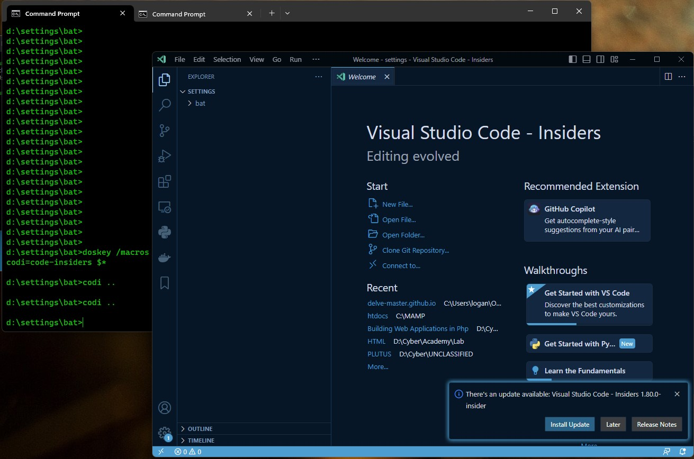
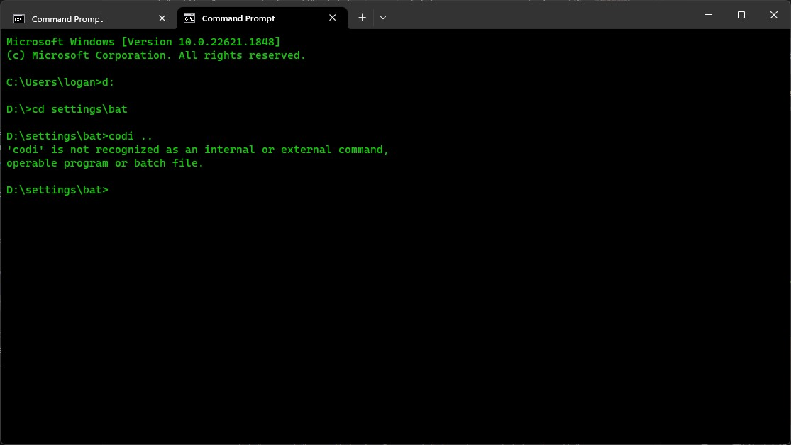
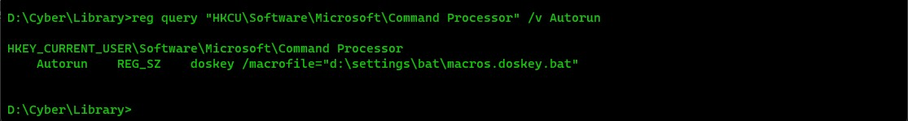
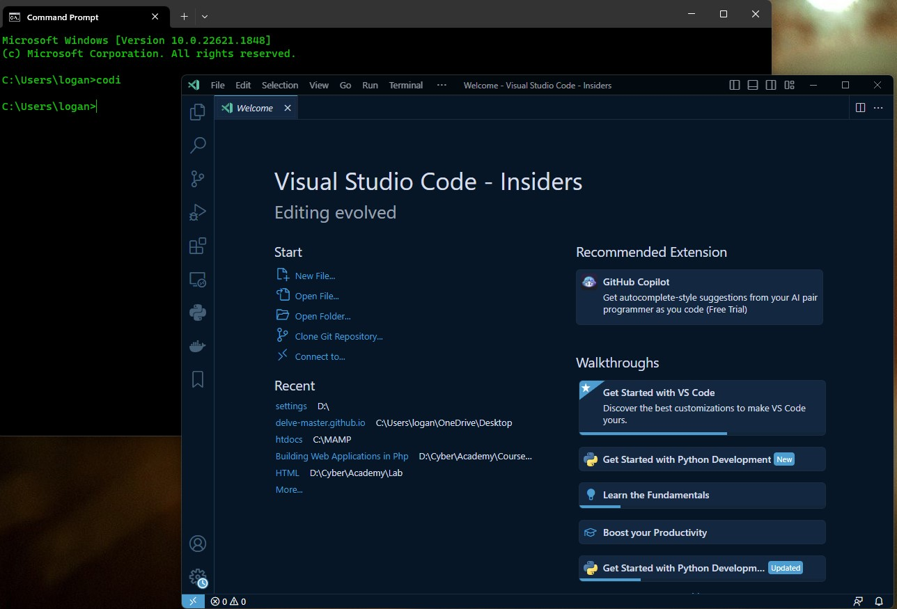

나는 빠른 기능 탐방을 위해 vscode 대신 일종의 베타 버전이라 할 수 있는 vscode insiders를 사용하는데, 특정 폴더트리에서 이걸 열려면 약간의 애로사항이 존재한다. 

내가 `C:\Users\me` 라는 디렉토리를 vscode에서 열려고 한다고 가정하자. 여러 방법이 있지만, 나는 굳이 vscode를 실행해서 귀찮게 GUI를 파헤치면서 폴더 여는걸 싫어한다. 

그래서 나는 보통 폴더 익스플로러에서 직접 그 폴더를 열어놓고 위의 주소창을 클릭해 cmd를 친 뒤 해당 폴더로 열린 cmd에서 `code ..` 를 입력해 직빵으로 vscode를 연다. 

이렇게하면 그 폴더가 vscode에 바로 열려있는데... 문제는 나는 vscode가 아니라 vscode insiders 사용자다. 

vscode의 기본 실행 명령어는 `code` 이지만 vscode insiders의 기본 실행 명령어는 `code-insiders` 이다. 

이건 **아주 큰 문제다.** 

코딩 쫌만 해본 사람은 코더들이 얼마나 귀차니즘에 쩔어사는 존재들인지 알 것이다. 따라서 나는 이 쓸데없이 긴 명령어를 줄여보기로 했다. 

```bash
doskey codi=code-insiders $*
```

위의 명령어는 `doskey`를 이용해 codi를 치면 code-insiders로 인식이 되게끔 매크로를 생성한다.



잘 작동된다! 

그렇게 신난 나는 컴퓨터를 끄고 잠시 뒤에 돌아와서 같은 방법으로 code-insiders를 열려고 했는데...


?


알아보니 `doskey`를 이용한 매크로 지정은 해당 세션안에서만 유효하다고 한다. 즉, **매크로를 등록했던 cmd 창을 닫으면 다음에 또 등록해야한다.**


밀려오는 빡침을 억누르고 스택 오버플로우를 미친듯이 뒤지기 시작했다. 

그렇게 얻은 결론은 **macro definition file** 을 만들자는 것이다.[^1] 컨셉은 간단하다.

`doskey` 로 등록한 매크로가 한 세션동안에만 유효하다면, 아예 매크로 설정 명령이 들어있는 batch 파일을 새로 만들어서 윈도우가 cmd를 실행할 때 마다 이 배치 파일을 실행하게끔 하는 것이다. 

즉, 매번 매크로를 등록해야하는 수고를 컴퓨터가 알아서 하게끔 만드는 것이다! 

### 매크로 자동 등록 batch 파일 생성하기


말은 거창한데 사실 내용은 별거 없다.

우선 notepad나 아무 텍스트 에디터나 실행해서 원하는 폴더에 `macros.doskey.bat` 파일을 생성하자. 내가 등록하고자 하는 매크로는 `doskey codi=code-insiders $*` 뿐이므로 나의 `macros.doskey.bat`에는 

```bash
doskey codi=code-insiders $*
```

딸랑 이거 한줄이다. 

이제 파일 저장하고 cmd를 켜서 다음 명령어를 실행하자.

```bash
reg add "HKCU\Software\Microsoft\Command Processor" /v Autorun /d "doskey /macrofile=\"d:\settings\bat\macros.doskey.bat\"" /f
```

이 명령어는 윈도우 레지스트리 키를 수정하는데, 앞으로 cmd가 실행될 때 `doskey /macrofile=\"d:\settings\bat\macros.doskey.bat\"` 명령어를 자동으로 입력하게끔 한다. 

이렇게 하면 앞으로 cmd가 실행될 때마다 내가 만들었던 batch 파일을 cmd가 인식할 수 있다. 

이제 내가 등록한 Autorun 값이 잘 있는지 확인해보자. 

```bash
reg query "HKCU\Software\Microsoft\Command Processor" /v Autorun
```

위 명령어로 query를 해보면 Command Processor의 Autorun 값이 잘 수정된걸 알 수 있다. 



이제 열어놨던 cmd 창을 전부 닫고 새 cmd를 열어서 매크로가 잘 작동하는지 알아보자. 



2시간의 투자 끝에 마침내 `code-insiders` 대신에 `codi` 만으로 VSCode Insiders를 열 수 있게 되었다! 

<p class="warning">
batch 파일 경로는 <span style="font-weight:bold">파일이 이동하면 더이상 유효하지 않다!</span> 내가 지정해놓은 파일 경로에 항상 batch 파일이 존재하게끔 신경쓰자. <br>
또한 윈도우 레지스트리 키를 수정하는 작업이 포함된 만큼 실수 안 하게끔 주의하도록 하자. 
</p>

(*end of post*)

---

[^1]: 이 답은 이 [stack overflow 답변](https://superuser.com/a/1134468) 에서 힌트를 얻었다. 