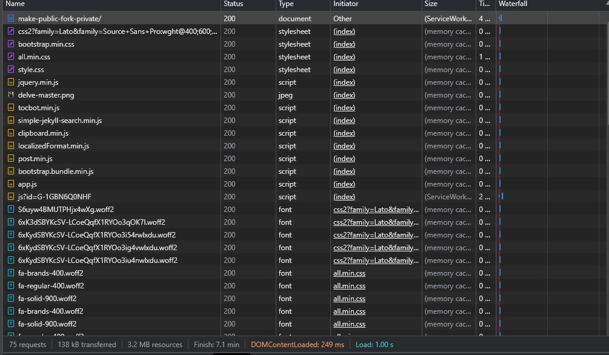
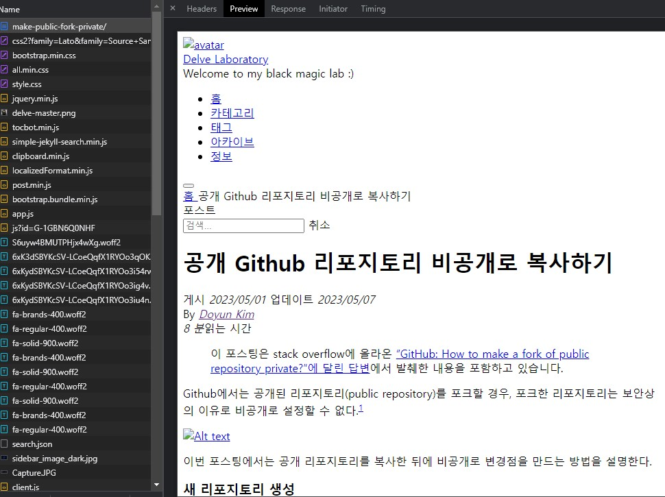

> 이 포스팅은 Charles Severance 교수(이하 척 아저씨)의 Coursera 강의 ["Building Web Applications in PHP"](https://www.coursera.org/learn/web-applications-php) Week 1 에서 다룬 내용을 정리합니다.

**동적 웹 페이지(Dynamic Web Page)**는 웹 페이지의 구성요소가 사용자 상호작용과 데이터베이스의 상태 변화 등에 따라 수시로 변화하는 웹 페이지를 의미한다. 예를 들면 사용자가 로그인 정보를 기입하면 자신의 프로필을 보여주는 SNS 사이트나 수시로 바뀌는 주가를 보여주는 주식 사이트 등이 있겠다.  

이번 포스팅에서는 이러한 동적 웹 페이지가 구성되는 과정을 간략히 알아보도록 하자. 

기본적인 동적 웹 페이지의 구조

동적 웹 페이지가 수행할 수 있는 온갖 화려한 묘기들은 사용자(이하 클라이언트 *client*)의 브라우저와 서버의 합작품이다.  

클라이언트가 원하는 웹사이트에 접속하는 과정을 간략히 요약하면,

1. 네이버에 접속하고 싶은 클라이언트는 구글 크롬, 파이어폭스, 마이크로소프트 엣지 같은 브라우저를 통해 네이버의 서버에 네이버 홈페이지를 요청한다. 
2. 이 요청을 받은 네이버의 서버는 네이버 홈페이지를 조립할 수 있는 설계도를 브라우저에 보내준다. 
3. 브라우저는 받은 설계도를 조립해서 클라이언트에게 네이버 홈페이지를 보여준다. 

정도로 할 수 있겠다. 

위의 이미지를 보면 Browser 보라색 직사각형에 HTML, CSS, DOM, JavaScript, JQuery 라고 적혀있는데, 각각의 역할을 간단하게 설명하면

- **HTML**: Hyper Text Markup Language의 약어. 웹 페이지를 구성하는 뼈대이다. 
- **CSS**: Cascading Style Sheet의 약어. 웹 페이지를 꾸며주는 역할을 한다.
- **JavaScript**: 클라이언트와 웹 페이지의 상호작용을 담당한다. 클라이언트가 버튼을 누르는 등의 액션을 취하면 이에 맞는 결과물을 뱉어내게 해주는 등, 동적 웹 페이지의 엔진 같은 존재다.[^1] 
- **DOM**: Document Object Model의 약어. HTML, CSS, JavaScript 등의 웹 페이지의 구성 요소를 트리 구조로 정리해주어 웹 페이지를 쉽게 수정할 수 있게 해준다.  
- **JQuery**: 자바스크립트의 라이브러리. DOM과 더불어 웹 페이지 수정을 더욱 쉽게 해준다. 

정도로 정리할 수 있다. 

### HTTP

HTTP (Hyper Text Transfer Protocol)는 브라우저가 서버와 소통하는 방식이라고 할 수 있다. 위에서 클라이언트가 브라우저를 통해 서버에게 원하는 자료를 요청한다고 했는데, 이 '요청'이 바로 HTTP를 통해 이루어진다. 

클라이언트가 브라우저에서 네이버로 접속할때 브라우저는 네이버의 서버로 GET request 라는 것을 전송한다. 네이버 서버가 이를 전달받으면 서버 내에서 네이버 홈페이지의 정보를 다시 돌려준다. 

**클라이언트는 요청(request)하고, 서버는 응답(response)한다.** 이 request-response 사이클이 HTTP의 정수이다. 

### URL

URL 이라는 말을 들어본 적은 있을 것이다. URL(Uniform Resource Locator) 은 클라이언트가 특정 웹사이트나 자료를 찾을 때 거의 필수적으로 사용한다. https://naver.com 등이 URL 의 예시이다. 

URL 주소는 한 줄로 구성된 문자열인데, 이 안에 "어떻게, 어디에서, 무엇을" 가져올지에 대한 정보가 담겨있다. 

제일 앞 부분은 브라우저와 서버가 어떻게 프로토콜로 통신하는지를 지정한다. 흔히 보는 `http://` 은 **HTTP을 이용해주세요** 라는 조건을 붙인 것이다.

다음으로 "어디에서" 정보를 찾을지 알려줘야 한다. 예시의 `www.dr-chuck.com` 는 **www.dr-chuck.com 의 서버에서 찾으세요** 라는 말이다. 

마지막으로 "무엇을" 찾을지 알려준다. 예시에서는 `/page1.htm` 를 불러오려고 한다. 

즉, `http://www.dr-chuck.com/page1.htm` 이 한 줄의 URL은 "**HTTP를 이용해 www.dr-chuck.com 에서 page1.htm 을 가져다주세요.** 라는 요청이 담겨있다. 

### anchor 태그

전술했던 URL 이외에도 클라이언트가 원하는 웹 페이지를 접속하는 방법이 또 있다. 바로 **하이퍼링크**를 통하는 것이다. 

HTML에는 `<a>` 태그가 있다. 이 태그에는 `href` 라는 속성(attribute)을 추가하는데, 여기에 특정 웹 사이트의 주소를 기입하면 클라이언트가 그 주소로 접속할 수 있다. 

쉽게 말하면 그냥 웹 페이지에서 "누르면 다른 웹 페이지로 가는 모든 것"들이 이에 해당한다. 버튼, 이미지, 그냥 링크 등등 종류도 많다. 

물론 anchor를 이용해서 원하는 페이지를 불러오는 것도 근본적으로 URL을 이용하는 것과 동일하다. 

웹 페이지에서 하이퍼링크를 눌러 다른 사이트로 이동하는 과정을 나열하면:

클라이언트가 링크를 클릭

클라이언트의 브라우저가 해당 웹 사이트의 서버에 GET request를 보냄 

서버는 요청받은 document를 찾아 클라이언트에게 content를 되돌려줌(response)

브라우저가 받은 content를 바탕으로 클라이언트가 볼 수 있는 웹 사이트를 보여줌(parsing/rendering)

물론 이건 상당히 간략하게 요약한거라 실제로는 더 복잡하다. 

## 서버의 Response

클라이언트의 GET request를 받은 서버는 클라이언트가 원하는 웹 페이지를 보기 위해 필요한 여러 "준비물"을 브라우저에게 준다. 

텔넷을 이용해 서버에 GET request를 보낸 모습
 

척 아저씨가 과거의 유산인 텔넷(Telnet)[^2]을 이용해 정확히 어떤 정보가 서버로부터 클라이언트에게 전달되는지 보여준다. 

캡쳐에서는 잘렸지만 `telnet data.pr4e.org 80` 명령어를 입력하여 data.pr4e.org의 서버와 접신한 뒤 GET request를 보내서 *page1.htm* 페이지를 요청한 모습이다. 숫자 80은 포트(port)를 의미하는데, 주로 HTTP를 이용해 서버와 데이터를 주고 받을 때 서버쪽에서 port 80로 요청을 받아들인다.[^3] 즉, 저 명령어는 "텔넷을 이용해 나를 data.pr4e.org 서버의 port 80에 연결 시켜줘" 라는 말이다. 

`GET` 명령어를 실행한뒤 전달받은 데이터를 보면 헤더(Header)와 바디(Body)라는 부분으로 나뉜걸 볼 수 있는데, **헤더는 자료에 대한 정보와 클라이언트와 서버 연결에 관련된 정보이고 바디는 자료 그 자체로 볼 수 있다**. 

우리는 구닥다리 텔넷을 사용하지 않아도 브라우저의 개발자 모드를 활용해 서버의 response를 확인할 수 있다. 

### 개발자 모드로 보는 request-response

구글 크롬 기준으로 웹 페이지에서 마우스 우클릭 후 요소 검사(Inspect Element)를 선택하거나 아예 처음부터 F12키를 누르면 개발자 모드를 켤 수 있다. 

크롬에서 개발자 모드를 켠 모습
 

위의 사진은 내 블로그에서 개발자 모드를 켠 모습인데, 이미 페이지가 로딩된 상태에서 처음 개발자 모드를 켜면 아무것도 안 보일 수도 있다. 이때는 개발자 모드가 켜진 상태에서 페이지를 새로고침하면 서버의 response들을 볼 수 있을 것이다.

response로 받은 content의 다양한 종류가 보인다.
 

꽤 많은 양의 content가 테이블로 정리되어있는데, **status**는 우리가 request했던 content를 서버가 찾아보고 우리에게 그 결과를 숫자로 알려주는 것이다. 위의 사진에서는 전부 200이라고 나오는데, 이건 서버가 해당 content를 성공적으로 찾아줬다는 뜻이다.[^4]

**Type**은 요청했던 content의 종류를 의미한다. 

그 외의 것들은 이번 포스팅에서는 다루지 않는다. 

이 중 하나를 눌러보면 텔넷에서 봤던 것처럼 response 내용을 볼 수 있다.

make-public-fork-private document를 눌러봤다.
 

제일 먼저 볼 수 있는 것은 헤더이다. 이 content에 관한 여러 정보가 보이는데, Request Method의 GET이 보이는가? 클라이언트인 내가 GET request를 통해 이 content를 불러왔다는 것을 알 수 있다. 그 외에 이 content를 가져온 **Request URL**, content의 길이[^5] **Content-Length**, content의 종류 **Content-Type** 등 사실상 서버의 response와 관련된 모든 정보를 볼 수 있다. 

다음으로 Preview 탭은 브라우저가 이 content를 parsing 하면 어떤 모습일지 보여주는데, 이건 preview 가 존재하는 content가 있고 없는게 있다. 

make-public-fork-private 의 경우 preview 가 존재하는데 요렇게 생겼다.
 

이 document 가 지금 내가 보고 있는 페이지의 뼈대인데, 확실히 뼈대답게 이미지도 없고 폰트도 기본 폰트만 있고 CSS등의 stylesheet가 전혀 없어 아주 초라하게 생겼다. 

다음으로, Response 탭에서 content의 실제 소스코드를 확인할 수 있다. 이는 텔넷으로 봤던 서버의 response에서 바디에 해당하는 부분이다. 
 
그리고 혹시 개발자 모드에서 [숫자] requests 부분을 눈치챘는가? 

나는 75 requests 라고 뜨는데, 내게 이 페이지를 보여주기 위해 브라우저와 서버가 75개의 request-response 사이클을 거쳤다는 말이다. 바꿔 말하면, 위에서 preview로 봤던 깡통 웹 페이지에 살을 붙혀서 예쁘게 만들기 위해 브라우저가 서버로부터 요청한 content가 75개 였다는 소리다. 

### 마치며... 

이번 포스팅에서는 유저인 클라이언트와 서비스 제공자인 서버가 어떻게 소통하여 우리가 보고자 하는 웹 페이지를 볼 수 있는지 다루었다. 

이 다이어그램은 클라이언트-서버의 request-response 사이클에 들어가는 모든 과정 및 요소들을 보여준다.

1. 클라이언트가 브라우저를 통해 원하는 사이트에 접속하기 위해 웹 서버에 request를 보냄
2. 웹 서버가 받은 request를 parse해서 php나 기타 벡엔드 관련 스크립트를 이용해 요청받은 content를 찾아줌
3. 브라우저는 웹 서버로부터 받은 response를 parse해서 DOM에 기반한 웹 페이지를 만들어 클라이언트에게 보여줌 

물론 이번 포스팅에서 다룬 내용에는 빠진 것들이 많은데, 대표적으로 그림에도 대놓고 보이는 데이터베이스(database, DB) 관련 내용등이 있다. 이를 비롯해 더 다뤄야할 내용은 추후 포스팅에서 자세하게 알아보자. 

(*end of post*)

---

[^1]: 자바스크립트는 웹 디자인 이외에도 백엔드에서도 유용하게 쓰인다. 웹 개발에 있어서 올라운더인 셈.  

[^2]: 텔넷은 과거에 원격 서버에 데이터를 전송하거나 불러올 때 사용했던 프로토콜이다. 현재는 서버들이 보안이 허술한 텔넷을 더이상 지원하지 않는 추세로 돌아서기 때문에 기본적으로 텔넷 사용은 권장되지 않는다. 

[^3]: Port 80은 서버가 클라이언트의 HTTP 요청을 받아들이는 용도로 사용하는 기본(default) 포트이다. 요즘 흔한 HTTPS 요청은 기본적으로 Port 443을 이용한다. 

[^4]: Status를 나타내는 숫자에는 규칙이 있는데, 400번대의 숫자는 클라이언트의 요청에 문제가 있을 때, 500번대의 숫자는 서버에 문제가 있을 때 볼 수 있다. 대표적인 예시로 에러코드 404는 클라이언트가 존재하지 않는 content를 요청했을 때 볼 수 있다. 

[^5]: 단위는 바이트(byte) 이다. 