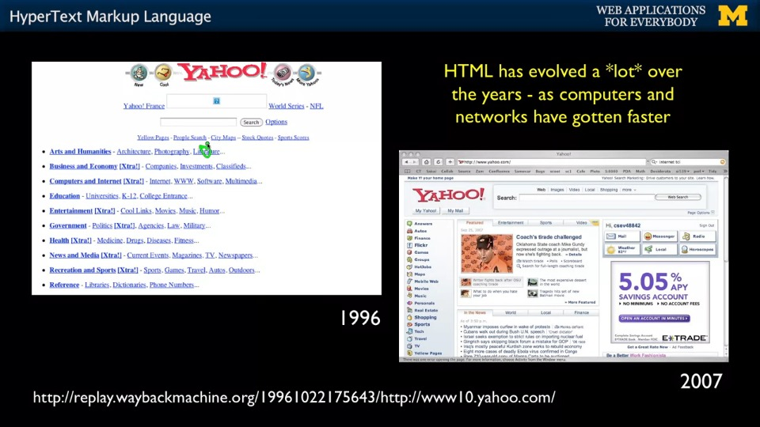
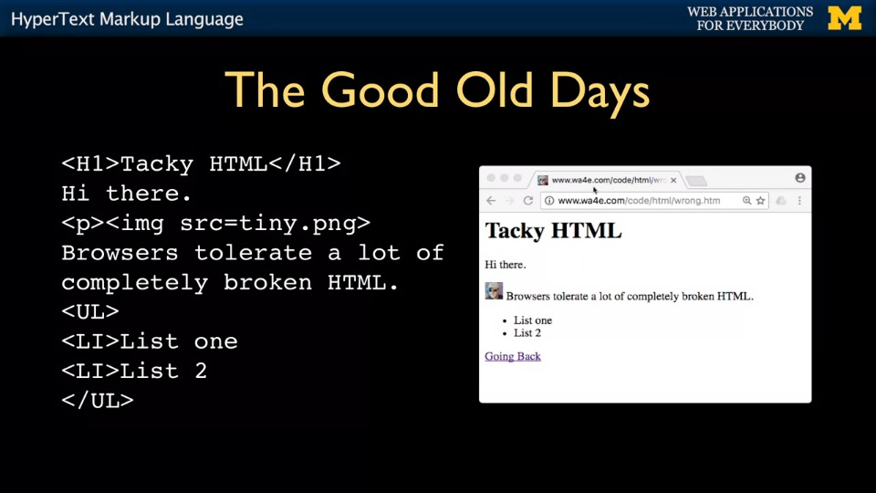

> 이 포스팅은 Charles Severance 교수(이하 척 아저씨)의 Coursera 강의 ["Building Web Applications in PHP"](https://www.coursera.org/learn/web-applications-php) Week 2 에서 다룬 내용을 정리합니다.

저번 포스팅에서는 클라이언트(유저)가 브라우저를 통해 서버로부터 웹 페이지를 받아내는 전반적인 과정을 알아보았다. 

클라이언트가 서버에게 원하는 자료를 달라고하면 서버는 이 요청을 만족시키기 위해 브라우저로 하여금 클라이언트가 보고자 하는 페이지를 만들 수 있게 필요한 자료를 전해준다. 

이 과정은 여기에 해당한다

이번 포스팅의 주제는 그 자료중에서도 가장 중요하다고 할 수 있는 웹 페이지의 뼈대를 이루는 **HTML**이다. 

## HTML의 특징

HTML는 HyperText Markup Language 라는 말의 약자인데, 솔직히 이건 그렇게 중요한건 아니고 HTML의 가장 중요한 특징은 <u>누구나 HTML로 작성된 문서의 서식을 이해할 수 있다는 것이다.</u> 

대부분의 사람들이 한번은 써본적이 있을 Microsoft Words의 경우 문서 파일의 확장자가 .DOC인데, 이건 소스 코드를 봐도 이진수로 작성되어 있기 때문에 일반적인 평민들은 읽어도 이게 무슨 쌉소리인지 이해할 수 없다. 워드 문서에 온갖 화려한 서식이 사용됐어도 어느 글자가 어느 서식으로 작성된건지 소스 코드만 봐서는 모른다는 소리다. 당연히 이러면 워드 프로그램이 없으면 자유롭게 문서를 수정할 수 없다. 

그에 반해 HTML의 소스 코드는 읽어보면 어느 부분이 어떤 역할을 하고 어떤 서식을 가졌는지 알 수 있다. 이를 가능케 하는 것은 바로 HTML의 **태그(tag)**이다. 

HTML을 조금이라도 다뤄봤다면 `
`, `<h1>`, `<a>` 등의 태그를 본 적이 있을 것이다. HTML의 관한 지식만 있다면 누구나 존재하는 웹 사이트의 HTML 코드를 읽고 해당 코드의 어느 부분이 페이지의 어떤 부분을 담당하는지 알 수 있다. 즉, **HTML은 접근성이 뛰어나다.** 

### HTML의 (대략적인) 역사 

1996년의 야후 닷컴 vs. 2007년의 야후 닷컴

[인터넷의 전신은 1960년대에 군용/학술용으로 사용되던 아파넷(ARPANET) 이었는데](https://www.scienceandmediamuseum.org.uk/objects-and-stories/short-history-internet), 애초에 민간용으로 개발되던 물건도 아니었기 때문에 요즘 IT 회사에서 눈에 쌍라이트 키고 달려들 UI/UX 개념은 당연히 존재하지 않았다. 그렇기 때문에 아파넷이 인터넷으로 진화한지 얼마되지 않은 태동기에는 위의 사진처럼 하이퍼링크로 떡칠된 웹 사이트가 태반이었다. 

하지만 저런 눈썩급 디자인을 가만히 두고 볼 수 없었던 미래의 웹 디자이너들은 웹 페이지의 뼈대인 HTML을 개량해나가기 시작해다. 

초기의 HTML은 그 당시의 디자인 스타일을 제하고 봐도 개판 5분전이었다. 브라우저가 어떻게든 페이지를 보여줄 수만 있으면 장땡이라 생각했기에 개발자가 HTML을 (요즘의 관점에서) 아주 개판으로 작성했어도 문제없이 웹 페이지를 보여줬다.[^1] 

초기의 HTML로 작성된 웹 페이지

대충 봐도 현재의 HTML 문법과 많이 다른걸 알 수 있는데, 대표적으로 **대문자로 작성된 tag**, **열려있는 tag**, **quotation mark("")에 둘러쌓여있지 않은 속성**이 눈에 띈다. 

문법을 느슨하게 잡는게 문제인 이유는 다른 개발자들이 만든 웹 페이지들에 통일성이 없다는 뜻이기 때문이다.

인터넷이 점점 더 확장되면서 사용자들이 기하급수적으로 늘어남에따라 웹 사이트 주인들은 미학적인 디자인을 추구하기 시작했고, 개발자들이 꼴리는대로 코딩을 하면 더 복잡해져가는 웹 사이트들을 관리하기 힘들어지기 때문에 HTML 또한 발전이 필요했다. 

이에 인터넷의 아버지인 팀 버너스 리 선생은 World Wide Web 컨소시엄이라는 단체를 만들어 HTML을 체계적으로 관리하기 시작했다. 이 시기에 HTML 문법이 규격화되고 본격적으로 전세계적 인터넷 시대의 시작을 일구어냈다고 할 수 있다. 

HTML의 escape character

클라이언트가 링크를 클릭

클라이언트의 브라우저가 해당 웹 사이트의 서버에 GET request를 보냄 

서버는 요청받은 document를 찾아 클라이언트에게 content를 되돌려줌(response)

브라우저가 받은 content를 바탕으로 클라이언트가 볼 수 있는 웹 사이트를 보여줌(parsing/rendering)

물론 이건 상당히 간략하게 요약한거라 실제로는 더 복잡하다. 

## 서버의 Response

클라이언트의 GET request를 받은 서버는 클라이언트가 원하는 웹 페이지를 보기 위해 필요한 여러 "준비물"을 브라우저에게 준다. 

텔넷을 이용해 서버에 GET request를 보낸 모습
 

척 아저씨가 과거의 유산인 텔넷(Telnet)[^2]을 이용해 정확히 어떤 정보가 서버로부터 클라이언트에게 전달되는지 보여준다. 

캡쳐에서는 잘렸지만 `telnet data.pr4e.org 80` 명령어를 입력하여 data.pr4e.org의 서버와 접신한 뒤 GET request를 보내서 *page1.htm* 페이지를 요청한 모습이다. 숫자 80은 포트(port)를 의미하는데, 주로 HTTP를 이용해 서버와 데이터를 주고 받을 때 서버쪽에서 port 80로 요청을 받아들인다.[^3] 즉, 저 명령어는 "텔넷을 이용해 나를 data.pr4e.org 서버의 port 80에 연결 시켜줘" 라는 말이다. 

`GET` 명령어를 실행한뒤 전달받은 데이터를 보면 헤더(Header)와 바디(Body)라는 부분으로 나뉜걸 볼 수 있는데, **헤더는 자료에 대한 정보와 클라이언트와 서버 연결에 관련된 정보이고 바디는 자료 그 자체로 볼 수 있다**. 

우리는 구닥다리 텔넷을 사용하지 않아도 브라우저의 개발자 모드를 활용해 서버의 response를 확인할 수 있다. 

### 개발자 모드로 보는 request-response

구글 크롬 기준으로 웹 페이지에서 마우스 우클릭 후 요소 검사(Inspect Element)를 선택하거나 아예 처음부터 F12키를 누르면 개발자 모드를 켤 수 있다. 

크롬에서 개발자 모드를 켠 모습
 

위의 사진은 내 블로그에서 개발자 모드를 켠 모습인데, 이미 페이지가 로딩된 상태에서 처음 개발자 모드를 켜면 아무것도 안 보일 수도 있다. 이때는 개발자 모드가 켜진 상태에서 페이지를 새로고침하면 서버의 response들을 볼 수 있을 것이다.

response로 받은 content의 다양한 종류가 보인다.
 

꽤 많은 양의 content가 테이블로 정리되어있는데, **status**는 우리가 request했던 content를 서버가 찾아보고 우리에게 그 결과를 숫자로 알려주는 것이다. 위의 사진에서는 전부 200이라고 나오는데, 이건 서버가 해당 content를 성공적으로 찾아줬다는 뜻이다.[^4]

**Type**은 요청했던 content의 종류를 의미한다. 

그 외의 것들은 이번 포스팅에서는 다루지 않는다. 

이 중 하나를 눌러보면 텔넷에서 봤던 것처럼 response 내용을 볼 수 있다.

make-public-fork-private document를 눌러봤다.
 

제일 먼저 볼 수 있는 것은 헤더이다. 이 content에 관한 여러 정보가 보이는데, Request Method의 GET이 보이는가? 클라이언트인 내가 GET request를 통해 이 content를 불러왔다는 것을 알 수 있다. 그 외에 이 content를 가져온 **Request URL**, content의 길이[^5] **Content-Length**, content의 종류 **Content-Type** 등 사실상 서버의 response와 관련된 모든 정보를 볼 수 있다. 

다음으로 Preview 탭은 브라우저가 이 content를 parsing 하면 어떤 모습일지 보여주는데, 이건 preview 가 존재하는 content가 있고 없는게 있다. 

make-public-fork-private 의 경우 preview 가 존재하는데 요렇게 생겼다.
 

이 document 가 지금 내가 보고 있는 페이지의 뼈대인데, 확실히 뼈대답게 이미지도 없고 폰트도 기본 폰트만 있고 CSS등의 stylesheet가 전혀 없어 아주 초라하게 생겼다. 

다음으로, Response 탭에서 content의 실제 소스코드를 확인할 수 있다. 이는 텔넷으로 봤던 서버의 response에서 바디에 해당하는 부분이다. 
 
그리고 혹시 개발자 모드에서 [숫자] requests 부분을 눈치챘는가? 

나는 75 requests 라고 뜨는데, 내게 이 페이지를 보여주기 위해 브라우저와 서버가 75개의 request-response 사이클을 거쳤다는 말이다. 바꿔 말하면, 위에서 preview로 봤던 깡통 웹 페이지에 살을 붙혀서 예쁘게 만들기 위해 브라우저가 서버로부터 요청한 content가 75개 였다는 소리다. 

### 마치며... 

이번 포스팅에서는 유저인 클라이언트와 서비스 제공자인 서버가 어떻게 소통하여 우리가 보고자 하는 웹 페이지를 볼 수 있는지 다루었다. 

이 다이어그램은 클라이언트-서버의 request-response 사이클에 들어가는 모든 과정 및 요소들을 보여준다.

1. 클라이언트가 브라우저를 통해 원하는 사이트에 접속하기 위해 웹 서버에 request를 보냄
2. 웹 서버가 받은 request를 parse해서 php나 기타 벡엔드 관련 스크립트를 이용해 요청받은 content를 찾아줌
3. 브라우저는 웹 서버로부터 받은 response를 parse해서 DOM에 기반한 웹 페이지를 만들어 클라이언트에게 보여줌 

물론 이번 포스팅에서 다룬 내용에는 빠진 것들이 많은데, 대표적으로 그림에도 대놓고 보이는 데이터베이스(database, DB) 관련 내용등이 있다. 이를 비롯해 더 다뤄야할 내용은 추후 포스팅에서 자세하게 알아보자. 

(*end of post*)

---

[^1]: 사실 HTML 특유의 문법을 빡세게 잡지 않는 풍조는 지금도 약간 남아있는게, 여타 다른 언어는 문법 오류 하나 때문에 멀쩡한 프로그램도 컴파일 시켜주지 않는게 대부분이지만 HTML 기반의 웹 페이지는 문법 오류가 있어도 일단 화면에 뭘 띄워주긴한다.  

[^2]: 텔넷은 과거에 원격 서버에 데이터를 전송하거나 불러올 때 사용했던 프로토콜이다. 현재는 서버들이 보안이 허술한 텔넷을 더이상 지원하지 않는 추세로 돌아서기 때문에 기본적으로 텔넷 사용은 권장되지 않는다. 

[^3]: Port 80은 서버가 클라이언트의 HTTP 요청을 받아들이는 용도로 사용하는 기본(default) 포트이다. 요즘 흔한 HTTPS 요청은 기본적으로 Port 443을 이용한다. 

[^4]: Status를 나타내는 숫자에는 규칙이 있는데, 400번대의 숫자는 클라이언트의 요청에 문제가 있을 때, 500번대의 숫자는 서버에 문제가 있을 때 볼 수 있다. 대표적인 예시로 에러코드 404는 클라이언트가 존재하지 않는 content를 요청했을 때 볼 수 있다. 

[^5]: 단위는 바이트(byte) 이다. 