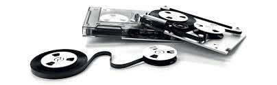
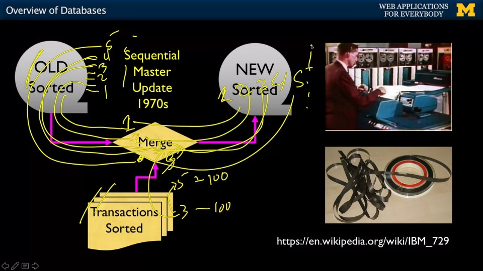
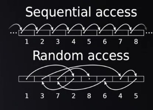
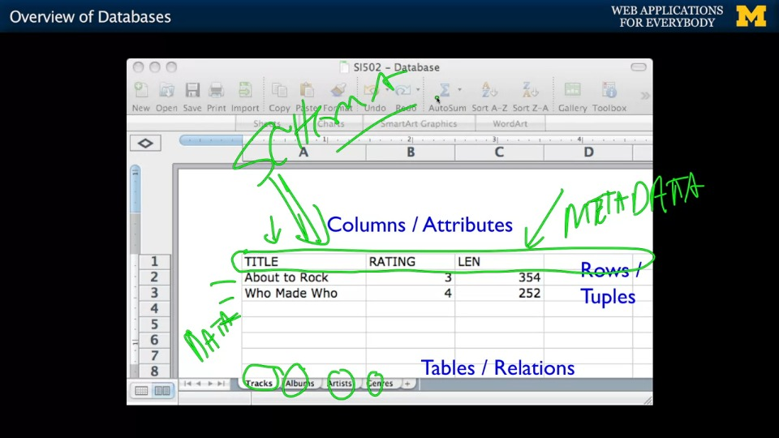

> 이 포스팅은 Charles Severance 교수(이하 척 아저씨)의 Coursera 강의 ["Introduction to Structured Query Language"](https://www.coursera.org/learn/intro-sql) Week 2 에서 다룬 내용을 정리합니다.
{: .prompt-info }

컴퓨터라는게 발명된 순간부터 우리는 수많은 분야에 이를 사용했다. 그런데 일기예보, 각종 시뮬레이션, 게임 등의 작업을 하다보면 어느 순간부터 결과값이나 기타 정보들을 어딘가에 저장할 필요가 생긴다. 

CPU나 메모리같은 컴퓨터 부품 자체에 때려박는다? 가능이야 하겠지만 부족한 용량, 느린 속도, 비효율성 등의 단점이 너무 명확하다.

그렇게 컴퓨터를 위한 **데이터베이스**(database, 이하 DB)의 역사가 시작된다. 

## 데이터베이스 개요

### 자기테이프
최초로 상용화된 DB/저장 매체는 꼬집기 힘들지만 대표적으로 자기테이프가 있다. 스카치 테이프같이 뭘 붙이는데 쓰는 테이프가 아니라 자성을 이용해 데이터를 저장할 수 있는 자석 같은걸 감아놓은 물건이다.

_자기테이프의 모습_

그럼 자기테이프를 이용한 DB 관리는 어떻게 해야할까? 테이프를 감아가며 '<u>처음부터 끝까지</u>' '<u>차례대로</u>' 진행한다. 

특정 데이터를 고쳐야한다면 처음부터 그 데이터가 있는 위치까지 차례대로 읽고 쓰고를 반복해야 하는데, 저장된 데이터를 읽기에는 문제 없을지 몰라도 수정 한번하려고 할 때마다 지옥을 경험하게 된다. 

예를 들어 은행이 고객의 계좌 정보를 담아둔 테이프 DB가 있다고 하자. 고객이 한명한명 은행을 찾아와 인출 및 출금을 한다. 은행은 업무종료 후 하루치 입출금 기록을 고객의 계좌정보가 담긴 DB에 업데이트 한다.

먼저 출입금 내역은 1번 고객 5만원 출금->2번 고객 3만원 입금->3번 고객... 이런 식으로 정돈(sort)되어 있어야 한다. 

1-2번 손님은 은행을 이용하지 않았고 3번 고객이 10만원을 인출했다는 기록이 있다면, 1-2번 손님의 계좌 정보는 그대로 테이프에 복붙하고 3번 손님의 계좌 정보는 출입금 기록을 반영하여 테이프에 저장한다. 

만약 1-799번째 손님이 은행을 이용하지 않았고 800번째 손님의 출입금 내역이 있다? 얄짤없이 첫번째 고객부터 순서대로 테이프에 복붙해야한다. 

_위에서 설명한 과정을 보여주는 다이어그램이다. 기존의 DB와 sort된 변경점을 합쳐 처음부터 끝까지 수정해야한다._

은행같이 자주 수정되는 데이터를 다루는 기관에서 이 짓거리를 한다고 생각해보라. 그래서 은행은 업무 종료후 DB 업데이트 하느라 2-3시간씩 테이프 돌리는게 일상이었다. 

이렇게 차례차례 데이터를 읽어들여야 하는 DB를 ***sequential database***, 과정은 *sequential master update* 라고 하는데, 단순명료하지만 지나치게 비효율적이라 더 나은 저장매체의 발달에 따라 자연스레 도태되었다.[^1] 

### 디스크 드라이브
다음으로 등장한 매체는 디스크 드라이브였다. HDD(Hard Disk Drive)라는 이름으로 잘 알려져있는데, 고속으로 회전하는 디스크와 이를 읽어들이는 헤드로 구성되어 있다. 옛날에 컴퓨터를 써본 적 있다면 본체에서 무언가 웅웅거리며 돌아가는 소리를 들어본 경험이 있을텐데, 바로 이 디스크가 회전하는 소리다.

_HDD의 모습. 뾰족한 바늘같이 생긴 장치가 헤드다._

HDD는 평상시에 회전하다가 특정 데이터를 읽거나 쓸 때 헤드가 그 데이터의 위치로 이동하면서 멈춘다. 평균적으로 디스크는 분당 7200번 회전하고 헤드도 만만찮게 빠르기 때문에 이전보다 말도 안되게 빠른 데이터 액세스가 가능하다. 

그러나 가장 획기적인 부분은 <u>차례대로 데이터를 수정할 필요가 없어진 점이다.</u> 드디어 자기테이프 같은 *sequential DB*를 사용하면 필히 물었을 "아니 왜 바꾸고 싶은것만 못 바꿔요"를 해결할 수 있게 된 것이다.

이게 가능한 이유는 HDD에는 데이터의 위치를 알려주는 목차(index)가 포함되어 있어서인데, 이를 이용해 수정하고자 하는 데이터가 위치한 장소를 찾을 수 있다. 

더이상 데이터가 정렬되어있을 필요도 없고 주소만 알고 있으면 빠르게 필요한 데이터를 불러낼 수 있기 때문에 HDD 같은 저장매체를 **Random Access Storage** 라고 분류한다.

요즘에는 HDD보다 빠른 SSD(Solid State Drive)가 더 보편적으로 쓰이지만[^2] 이 둘의 근본적인 데이터 접근법은 같다. 

### 관계형 데이터베이스(RDBMS)

이때까지 하드웨어 형태의 DB를 살펴봤는데, 관계형 데이터베이스(Relational DataBase Management System, 이하 RDBMS)은 소프트웨어적 개념이다. 즉, 저장 매체속 데이터를 관리하는 일종의 프로그램이다.

RBDMS는 DB에 저장된 데이터를 테이블(table)로 관리하는데, 데이터의 특징별로 행(row)과 열(column)에 구분지어 저장하는 방식을 취한다. 마이크로소프트 엑세스나 구글 스프레드시트 같은 액셀형 프로그램을 써봤다면 바로 이해할 수 있을 것이다.

_RBDMS와같이 테이블을 이용하여 관리되는 데이터의 모습_

위의 사진을 보면 테이블의 최상단은 데이터가 아니라 데이터를 구분짓기 위한 정보를 담고 있는데, 이는 Meta Data로 데이터에 관한 데이터라고 볼 수 있다. 

또한 RDBMS에는 **schema** 라는 개념도 있다. Schema는 DB내의 데이터를 정리하는 일종의 법률로 생각하면 된다. 이 column에는 어떤 값이 들어가는지, 어떤 데이터 종류가 들어갈 수 있는지, 값은 얼마나 클 수 있는지 등등 많은 규칙을 정해놓는다. 

#### SQL

**SQL(Structured Query Language)**은 데이터베이스 내의 데이터 생성, 수정, 삭제 등의 작업을 하기 위한 "언어"다. 내 데이터베이스를 관리하는 사람과는 SQL 언어로 소통한다고 생각하면 편할 듯하다. SQL은 표준화가 아주 잘되어 있어 <u>어느</u> 데이터베이스에서나 사용된다.[^3]  

클라이언트의 요청이 DB 내의 데이터를 필요로 한다면 서버가 DB와 소통하여 작업을 하는데 이때 이 역할을 하는 서버 및 서버가 사용하는 소프트웨어를 **database server**라고 한다. 이 강의에서 사용하게 될 MySQL도 이런 DB 서버의 일종이다.

구체적인 SQL 문법 및 사용은 다음 포스팅에서 진행한다. 

(*end of post*)

---

[^1]: 다만 자기테이프의 가성비, 보관의 편리함, 안정성 등의 장점 덕분에 아직도 공공기관이나 사업체에서 백업용 저장 매체로 사용된다. 

[^2]: SSD에는 HDD같이 물리적으로 회전하는 부품(디스크, 헤더)이 필요없기 때문에 일반적으로 훨씬 빠르다. 

[^3]: 이게 가능한 이유는 NIST(National Institute of Standards and Technology)라는 미국 정부 기관에서 총대메고 그렇게 만들었기 때문이다. 데이터베이스 관리 표준이 제대로 정립되지 않았던 시절에는 어떤 데이터베이스 관리 시스템이 효율적인지를 두고 논쟁이 자주 일어났다. 이런 상황에서 미국 정부가 "각자 의견 잘 조율해서 하나로 통합하셈. 안그러면 아무것도 안 받아드릴거임" 같은 식으로 중재를 했기 때문에 지금의 표준화가 잘된 SQL 체제가 생겨날 수 있었다. SQL의 탄생에 NIST가 꽤 많은 기여를 했다고 인정받는건 이 때문.

