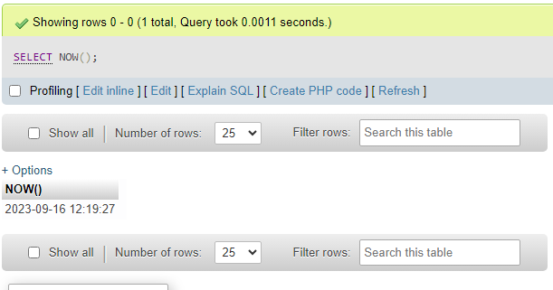

> 이 포스팅은 Charles Severance 교수(이하 척 아저씨)의 Coursera 강의 ["Introduction to Structured Query Language"](https://www.coursera.org/learn/intro-sql) Week 2 에서 다룬 내용을 정리합니다.
{: .prompt-info }

이번에는 SQL에서 다루는 데이터의 종류를 알아보자. 여기서 말하는 데이터 종류는 우리가 SQL 테이블에 쑤셔넣게될 데이터 값의 타입을 의미한다. 

다른 언어들처럼 SQL에서 다루는 데이터도 float, int, char 같은 종류가 있기 때문에 각각의 종류가 어떤 특징을 가지고 있는지 알아두는게 중요하다.

## String Fields

어느 언어에나 존재하는 String 타입이다. SQL에서 String으로 구분짓는 데이터에는 대표적으로

- Character
- Binary
- BLOB
- TEXT

등이 있다. 이것 외에도 **ENUM**과 **SET** 타입도 존재하지만 이번 코세라 강의에는 등장하지 않은 개념이기 때문에 관심있다면 MySQL의 doc를 읽어보자.[^1] 
 

### Character Fields: CHAR과 VARCHAR

Character 타입은 **CHAR**과 **VARCHAR** 2가지로 구분지을 수 있다. 주로 데이터의 길이가 일정하다면 CHAR, 다양하다면 VARCHAR을 사용한다.

CHAR은 고정 크기 문자열 데이터를 지정한다. 따라서 어떤 열이 `CHAR(10)` 의 condition이 있다면 실제 데이터 값이 어떻든 반드시 10만큼의 공간을 예약해둔다.

반대로 VARCHAR은 가변 크기 문자열 데이터를 지정하기 때문에 `VARCHAR(10)`은 데이터 값이 최대 크기보다 작다면 알아서 공간을 줄인다. VARCHAR의 VAR은 variable을 의미하는데 말 그대로 크기가 유동적으로 변할 수 있다고 외우면 좋다.

다만 일반적으로 입력값의 길이가 일정하다면 CHAR을 사용하는게 속도가 더 빠르다. 값의 크기를 특정하기 힘들때 VARCHAR을 사용하자.

> 참고로 CHAR이나 VARCHAR에서 얘기하는 크기는 <u>순수한 문자 수</u>를 의미하지 문자가 차지하는 **바이트** 크기는 의미하지 않는다. 따라서 한글 같은 멀티바이트 문자 집합은 문자 당 2 바이트 이상을 잡아먹지만 `VARCHAR(10)` 같은 제한이 걸려있는 행에도 10자 이하라면 충분히 들어갈 수 있다. 
{: .prompt-info }

### Text Fields

Text 타입은 character 타입과 달리 인덱싱도 안되고 `ORDER BY` 같은 방법으로 정렬하지 못하는 긴 문자열 데이터를 지정할 때 사용한다.

**Character**와 비교했을 때의 가장 큰 차이점은 Character보다 다루는 문자 수가 상당히 크다는 것이다. 이 덕에 블로그나 sns 댓글등에 주로 사용된다.

Text 타입에 속하는 데이터는 다음과 같다:

|    타입    | 허용하는 최대 문자 수 |
| :--------: | :-------------------: |
|  TINYTEXT  |  최대 255 characters  |
|    TEXT    |      최대 65 KB       |
| MEDIUMTEXT |      최대 16 MB       |
|  LONGTEXT  |       최대 4 GB       |

TEXT부터는 아예 데이터 크기로 한계를 구분할 만큼 대용량의 문자를 다루는 것을 알 수 있다. 

### Binary Fields: BINARY와 VARBINARY 

Binary 타입은 이름처럼 1 바이트(= 8 비트)의 이진수로 데이터를 끊어서 저장한다.CHAR이나 VARCHAR이 문자를 문자의 갯수로 저장하는 것과는 대조적인데, 애초에 Binary는 문자를 이해하지 못한다. 

Binary는 이름 그대로 0과 1로만 데이터를 구분하기 때문에 정렬 등의 작업을 하기 좋은 데이터 타입은 아니다. 

Binary도 **VARBINARY**이라는 버전의 타입이 있는데 CHAR과 VARCHAR의 관계와 같다. 

### BLOB (Binary Large Object)

BLOB은 주로 사진, 동영상, PDF 문서, 대용량의 raw data[^2]와 같은 미디어 파일을 저장할 때 쓰는 타입이다.

일반적으로 작은 이미지나 프로필 사진같은 파일들은 용량을 많이 잡아먹지 않기 때문에 BLOB의 형태로 DB에 저장해도 상관없을 수 있지만 영화같은 큰 동영상 파일은 DB에 저장하면 자칫 쿼리의 처리속도를 어마어마하게 느리게 만들 수 있기 때문에 웬만하면 별도의 저장매체에 저장해두고 대신 이를 찾을 수 있는 정보(예를 들면 URL이나 저장 경로)를 DB에 저장해 불러오는 방법이 쓰인다. 

DB는 데이터를 저장하는 용도로 사용하는거라 파일을 저장하고 싶으면 그런 용도로 쓰라고 만든 SSD 같은 저장매체를 이용하는게 좋다. 

Binary라는 이름에서 알 수 있듯 BLOB 데이터도 이진수 형태의 byte 단위로 저장된다.  

또한 BLOB 데이터에도 원하는 크기에 따라 여러 타입이 존재한다. 

|    타입    | 허용하는 최대 문자 수 |
| :--------: | :-------------------: |
|  TINYBLOB  |  최대 255 byte  |
|    BLOB    |      최대 65 KB       |
| MEDIUMBLOB |      최대 16 MB       |
|  LONGBLOB  |       최대 4 GB       |

가장 큰 BLOB 타입인 LONGBLOB도 4 GB가 최대인 것을 볼 수 있는데, 이를 봐도 MySQL과 같은 DB는 대용량 파일의 저장에는 적합하지 못하다는 것을 알 수 있다. 

## Numeric Fields

이제까지 문자열 위주의 데이터를 살펴봤으니 숫자 위주의 데이터도 살펴보자. 
이 강의 노트에서는 대표적인 숫자 데이터 타입인 `int`와 `float`만을 정리한다. 

### Integer Numbers

프로그래밍에 있어서는 아주 친숙할 `int` 타입이다. 

늘 그랬듯, INT 타입은 정렬등의 작업에 아주 효율적이고, 용량도 적게 잡아먹고, 처리 속도도 빠른 강점을 지닌다. 

SQL에는 다음과 같은 INT 데이터가 있다: 

|    타입    | 허용하는 값 |
| :--------: | :-------------------: |
|  TINYINT  |  (-128, 128)  |
| INT \|\| INTEGER | (-32768, 32768) |
| MEDIUMINT | (2 Billion) |
|  LONGINT  | (10^18) |

### Floating Point Numbers: FLOAT과 DOUBLE

`int`와 마찬가지로 프로그래밍에 있어서는 아주 친숙할 `float` 타입이다. 

Floating point 계열의 타입은 보편적으로 속도나 온도같이 이론상 정확도가 무한하게 늘어날 수 있는 값 등을 저장할 때 쓰인다.  

SQL에는 다음과 같은 floating number 타입의 데이터가 있다: 

|    타입    | 허용하는 값 |
| :--------: | :-------------------: |
|  FLOAT (32-bit) |  10^38에 소수점 7자리까지 |
| DOUBLE (64-bit) | 10^308에 소수점 14자리까지 |

일반적으로 7자리 이상의 정확도를 필요로하는 경우가 드물기 때문에 대부분 FLOAT으로도 충분하지만 필요하다면 DOUBLE의 사용으로 14자리까지의 정확도를 확보할 수도 있다.

> `float` 타입이 소수점을 다루는데 사용되는건 맞지만 **금액같이 소수점이 정해져있는 값은 float으로 저장하면 안된다.** Float은 어디까지나 어림잡은 값이기 때문에 $10.25 같이 소수점이 확실한 데이터는 float으로 저장하면 반올림 에러등으로 값이 부정확하게 나올 수 있다. 따라서 이런 경우에는 `int` 계열이나 DECIMAL 등의 다른 타입을 이용해야한다. 
{: .prompt-warning }

## Date and Time Fields

만약 시간이나 날짜같은 데이터를 저장하려면 어떻게 해야할까? 문자로만 표현하기도 힘들고, 그렇다고 숫자로만 나타내기도 한계가 있어보인다. 

그렇기 때문에 SQL에는 시간이나 날짜를 다룰 때 필요한 데이터 타입이 따로 존재한다. 

|    타입    | 포멧 |
| :--------: | :-------------------: |
|  TIMESTAMP |  YYYY-MM-DD HH:MM:SS' (1970-2037) |
| DATETIME | YYYY-MM-DD HH:MM:SS' |
| DATE |  YYYY-MM-DD'|
| TIME | HH:MM:SS' |

먼저 날짜를 저장하기 위한 데이터 타입이 3개로 꽤 많은 것을 볼 수 있는데, 그 중에서도 TIMESTAMP와 DATETIME이 눈에 띈다. 

이 둘의 포멧은 거의 완전히 같지만 TIMESTAMP 타입은 특이하게도 1970년과 2037년 사이의 날짜만 저장할 수 있다. 이에 얽힌 사연은 **2038년 문제**을 찾아보면 알 수 있다. 

여하튼 이런 제한때문에 기본적으로 초 단위의 날짜 데이터를 저장할 때는 DATETIME만 사용해도 문제는 없다. DATETIME은 위의 포멧을 따르는 모든 날짜를 저장할 수 있기 때문. 물론 이때문에 1000년 미만, 9999년을 초과하는 날짜는 사용할 수 없다. 

현업에서는 보통 자주 수정되지 않는 날짜 데이터를 저장할 때 DATETIME을 사용하고, '최근 수정 날짜', '마지막 업데이트' 같이 값이 자주 바뀌는 날짜 데이터를 저장할 때 TIMESTAMP를 사용한다. 

### NOW()

MySQL의 경우 현재 날짜와 시간을 불러올 수 있는 `NOW()` 함수가 기본 탑재되어 있다.

따라서 현재 날짜와 시간 데이터가 필요하다면 `SELECT NOW()` 등의 작업으로 이를 해결할 수 있다. 

(_end of post_)

---

[^1]: **ENUM** 타입: [https://dev.mysql.com/doc/refman/8.0/en/enum.html](https://dev.mysql.com/doc/refman/8.0/en/enum.html)   **SET** 타입: [https://dev.mysql.com/doc/refman/8.0/en/set.html](https://dev.mysql.com/doc/refman/8.0/en/set.html)

[^2]: 로 데이터(raw data)는 주로 센서 값이나 관측 데이터 같은 사후 처리가 필요한 데이터를 말한다. 