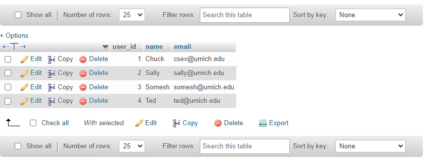
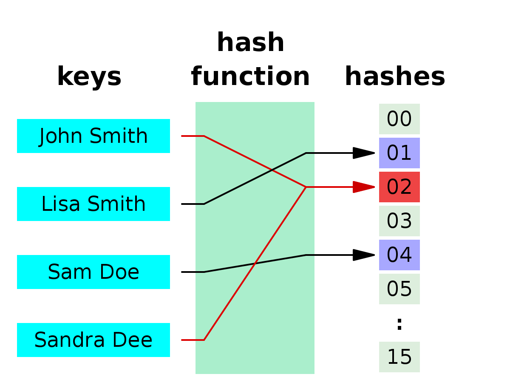
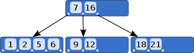

> 이 포스팅은 Charles Severance 교수(이하 척 아저씨)의 Coursera 강의 ["Introduction to Structured Query Language"](https://www.coursera.org/learn/intro-sql) Week 2 에서 다룬 내용을 정리합니다.<br><br>
**이 강의에서 사용하는 DB는 MySQL입니다.** 따라서 SQL 문법은 MySQL 기준이기 때문에 다른 DB를 사용하시는 분들은 그에 맞춰서 SQL 문법을 수정하시면 됩니다. 
{: .prompt-info }

[예전 포스팅](https://delve-master.github.io/posts/database-overview/)에서 HDD 같은 하드디스크 저장매체가 어떻게 데이터를 처음부터 차례대로 확인하지 않고도 특정 데이터를 찾아내는지 잠깐 언급했던 적이 있었다. 

이번 포스팅에서는 MySQL 같은 DB에서 비슷하게 특정 데이터를 찾아내는 방법, 인덱스(index)에 대해서 알아보려한다. 

```sql
-- 이전에 Users 테이블을 만든적이 없다면 스킵
DROP TABLE Users;

CREATE TABLE Users (
	user_id INT UNSIGNED NOT NULL AUTO_INCREMENT,
	name VARCHAR(128),
	email VARCHAR(128),
	PRIMARY KEY(user_id),
	INDEX(name)
)
```

먼저 위 SQL 쿼리로 *Users* 라는 테이블을 만들어본다. 예전에 만들었던 *Users* 테이블에 새로운 부분이 몇 가지 보이는데 차례대로 살펴보자. 

먼저 `user_id INT UNSIGNED NOT NULL AUTO_INCREMENT` 라인을 보자. 이 부분은 *user_id* 라는 열(column)을 만든다. `INT`는 이곳에 integer 값이 들어간다는 뜻이고, `UNSIGNED`는 그 값에 "부호가 없다"는 <u>제한을 건다.</u> 바꿔 말해 항상 양의 정수여야만 한다. `NOT NULL`은 이 칸은 빈칸일 수 없다는 <u>제한을 건다.</u> 즉, 이 칸에 값을 채우지 않고는 새로운 데이터를 추가할 수 없다. 마지막으로 `AUTO_INCREMENT`는 새로운 데이터가 추가될 때마다 *user_id*에 새로운 값을 부여한다는 특징을 추가한다. 'increment'라는 말 그대로 새로운 데이터가 추가되면 마지막 데이터에 부여했던 값에 1을 더하기 때문에 AUTO_INCREMENT로 추가된 값은 데이터들끼리 겹치지 않을 것이다. 이런 특징덕에 특정한 데이터 하나를 핀포인트하는 인덱싱을 할 때 유용하게 쓰인다.

`AUTO_INCREMENT`의 위력을 보기 위해 *Users*에 데이터를 추가해보자.

```sql
INSERT INTO Users (name, email) VALUES ('Chuck', 'csev@umich.edu');
INSERT INTO Users (name, email) VALUES ('Sally', 'sally@umich.edu');
INSERT INTO Users (name, email) VALUES ('Somesh', 'somesh@umich.edu');
INSERT INTO Users (name, email) VALUES ('Ted', 'ted@umich.edu');
```



`AUTO_INCREMENT` 덕분에 특정하지 않아도 *user_id* 필드가 자동으로 채워진 것을 볼 수 있다.


## 두 가지의 인덱스 종류: Primary Key와 Index

위의 코드 마지막 두 줄에 `PRIMARY KEY()`와 `INDEX()`라는 각각 새로운 개념이 등장하는데, 이들은 DB에서 특정 데이터를 찾을 때 어떤 값을 중심으로 찾아야하는지 지정해주는 역할을 한다. 

### PRIMARY KEY

`PRIMARY KEY()`에서 지정하는 값은 **고유해야하고, 비어 있으면 안된다(NOT NULL)**는 <u>제한을 건다.</u> 또한 테이블 당 지정할 수 있는 PRIMARY KEY는 하나뿐이다. 다만 하나 이상의 column을 지정할 수는 있다.

고유한 값을 요구하는 점에서 알 수 있듯, PRIMARY KEY는 하나의 특정 데이터를 찾으려할 때 사용한다. `PRIMARY KEY(user_id)`는 특정 데이터를 찾을 때 그 데이터의 *user_id*값을 이용하라고 알려준다.

위에서는 `AUTO_INCREMENT`로 생성된 값을 Primary Key로 사용했지만, 보편적으로 사용되는 Primary Key는 **해시(Hash)**라는 기법으로 만든다. 

해시는 입력값을 해시 함수(hash function)이라는 공식에 때려박고 일정한 크기의 고유한 값으로 변환해준다. 입력값의 크기와 무관하게 일정한 크기의 "이론상" 고유한 값을 만들어주는 것이다. 이때 동일한 입력값은 반드시 동일한 해시값을 가져야한다. 


_Hash의 작동 원리를 보여주는 다이어그램. 입력값의 크기와 무관하게 항상 두 자리의 숫자가 배출되는 것을 볼 수 있다_

다이어그램을 보면 John Smith와 Sandra Dee가 같은 해시값(02)를 가져서 충돌(collision)한 것을 볼 수 있는데, 이건 일반적으로는 일어나면 안되는 일이다.[^1]


어찌됐든 Primary Key를 이용하면 정확하게 들어맞는 값을 바탕으로 특정 데이터를 잡아내는 상황에서 매우 빠르고 효율적이다.  


### INDEX

`INDEX`은 `PRIMARY KEY`에 비해 조금 더 느슨하게 데이터를 검색할 수 있는 일종의 목차를 제공한다. `INDEX`가 유용하게 사용되는 곳은 **B-Tree** 모델이 있다. 


_B-Tree 모델의 모습_

B-Tree는 특정 조건에 맞는 데이터를 묶어서 정리해놓은 트리(Tree) 타입의 데이터 모델이다. 위 다이어그램의 예를 들면, 7이하의 수, 8이상의 수, 16이상의 수 같은 식으로 데이터를 구분지어 놓은 것을 볼 수 있다. 

`INDEX`는 이런 식으로 특정 조건에 맞는 데이터끼리 모아놓는식으로 정리된 환경에서 최상의 효율을 보인다. 이런 이유로 첫글자 순서 기반 검색(prefix lookup)이나 정렬 등에 주로 사용된다. `INDEX(name)`같은 경우, *name*의 값을 규칙에 따라 정렬해서 특정 데이터의 추가, 삭제, 검색을 더 용이하게 해준다. 


#### 컨스트레인트(constraint)의 개념

내가 이곳저곳에 "제한을 건다"라는 부분을 밑줄 쳐놓은 걸 알 수 있을텐데, 왜 그랬을까? 그건 바로 해당 부분들이 DB가 잘 관리될 수 있도록 해주는 컨스트레인트이기 때문이다. 

컨스트레인트는 DB가 질서정돈된 상태로 유지할 수 있게 해주는 법이라고 할 수 있다. 만약 내 방의 물건들이 어질러져 있다면 필요한게 있을 때 제대로 찾을 수가 없지 않은가? 그렇기 때문에 필요한 물건을 딱딱 찾을 수 있게끔 방을 정리할 필요가 있고 이때 어디에 뭘 배치해야 하는지 규칙이 필요할 것이다. 

DB도 마찬가지다. 위에서 정리한 인덱스 기법 그 어떤것도 제대로 정리되어있지 않은 데이터에는 써먹을 수가 없다. 그렇기 때문에 나중에 고생하지 않도록 DB의 데이터가 어느 정도는 규칙에 맞게 정리되어있어야 좋을 것이고, 그게 바로 컨스트레인트가 필요한 이유이다.

SQL에는 이 포스팅에서 다루지 않은 여러 컨스트레인트가 있기 때문에 관심있으면 검색해보자.


## 마치며...

처음 테이블을 만들 때부터 인덱스를 지정할 필요는 없다. 어느 정도 application을 돌려보다 성능저하가 눈에 띄게 심해졌을 때 나중에 설정해도 큰 문제는 없다. 

추가로 인덱싱에도 여러가지 방법이 있기 때문에 어떤 종류의 인덱싱을 사용하는지 등의 고민은 다루는 데이터의 성질에 따라 결정하면된다. 특히 요즘같이 AI가 잘 발달된 시대의 흐름을 타서 아예 AI의 추천이나 DB가 알아서 최적화된 결정을 하게끔 할수도 있겠다. 

(_end of post_)

---

[^1]: [물론 현실적인 범주 내에서 32비트 기반의 해시 알고리즘은 항상 충돌이 일어나게 된다.](https://softwareengineering.stackexchange.com/a/145633)